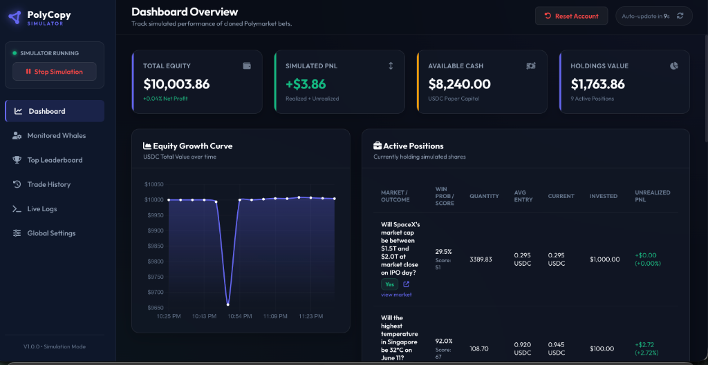

# PolyCopy Simulator

A copy-trading simulator for Polymarket. It tracks the top 1,000 weekly whales from the Polymarket leaderboard, watches their trades in real time, and simulates copying them with configurable sizing, filters, and execution logic. No real money is involved — it's a paper trading engine for testing copy-trade strategies before putting capital at risk.



## What it does

The bot polls the Polymarket global trades feed every 30 seconds and cross-references each trade against a list of followed whale wallets (auto-synced hourly from the weekly leaderboard). When a whale buys or sells a position, the simulator replicates the trade with simulated USDC, tracks positions, updates live prices via the CLOB API, and settles resolved markets automatically.

It filters out noise — sports betting, short-term crypto price predictions — and focuses on markets where informed traders actually have an edge: politics, business events, weather, regulatory outcomes, and similar categories.

## Key features

- **Whale tracking**: Follows the top 1,000 weekly performers from the Polymarket leaderboard. Syncs hourly.
- **Configurable filters**: Exclude sports, exclude crypto, set price range limits, set max days to resolution, minimum score thresholds.
- **Niche-market priority**: Optionally prioritize weather, science, space, and regulatory contracts. These bypass price-range filters and get a 25% sizing bonus. The thesis is that these niche markets are where prediction markets are most often mispriced.
- **Dynamic sizing**: Scale position sizes from 0.2x to 3x based on each whale's weekly ROI, leaderboard rank, and trade conviction (measured by their bet size). Top-ranked whales with strong ROI on large bets get bigger allocations.
- **Live valuation**: Positions are priced against the CLOB midpoint. Portfolio equity curve is tracked over time.
- **Automatic resolution**: When a market resolves, positions are settled and PnL is recorded.
- **Execution modes**: Either match the whale's exact price or use live CLOB ask/bid prices with configurable slippage.

## How it works

1. On startup, the bot syncs the top 1,000 whales from the Polymarket weekly leaderboard and stores their wallet addresses, PnL, and volume.
2. Every polling cycle, it fetches the latest 200 trades from the global Polymarket trades feed.
3. For each trade, it checks if the trader is in the followed list. If so, it runs the trade through a filter pipeline (crypto exclusion, sports exclusion, price range, expiry window, best-bet score).
4. Trades that pass all filters are copied: a simulated buy is executed, the position is opened, and everything is logged.
5. When a followed whale sells, the simulator proportionally exits the corresponding position.
6. Resolved markets are detected via the Gamma API and settled automatically.

## Stack

- **Backend**: Python, FastAPI, served with Uvicorn
- **Frontend**: Vanilla HTML/CSS/JS, Chart.js for the equity curve
- **APIs**: Polymarket Data API (trades, leaderboard), Gamma API (market details, resolution), CLOB API (live pricing)
- **Deployment**: Render (free tier)

## Running locally

```bash
pip install fastapi uvicorn requests
python main.py
```

Opens at `http://127.0.0.1:8000`. The simulation starts automatically.

## Configuration

All settings are configurable from the web UI under the Settings tab:

- Starting capital
- Polling interval
- Execution mode (whale price match vs. live CLOB)
- Slippage (basis points)
- Price range filters (min/max)
- Max days to resolution
- Sports/crypto exclusion toggles
- Niche-market priority toggle
- Dynamic performance-based sizing toggle
- Best-bet score threshold

Settings persist to `data/config.json`. Simulation state (positions, trades, logs) persists to `data/state.json`.

## Disclaimer

This is a simulator. It does not execute real trades or interact with any wallet. All positions are virtual.
